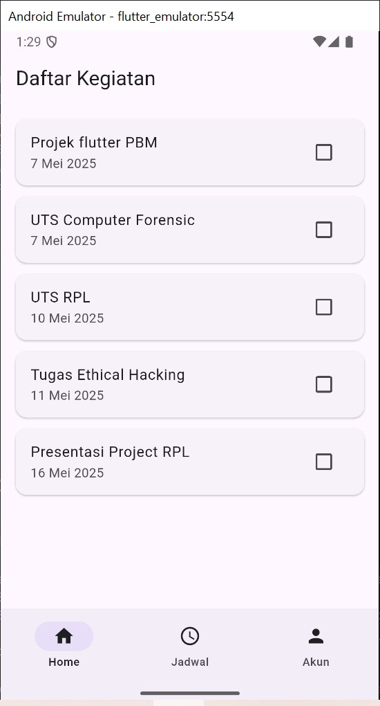
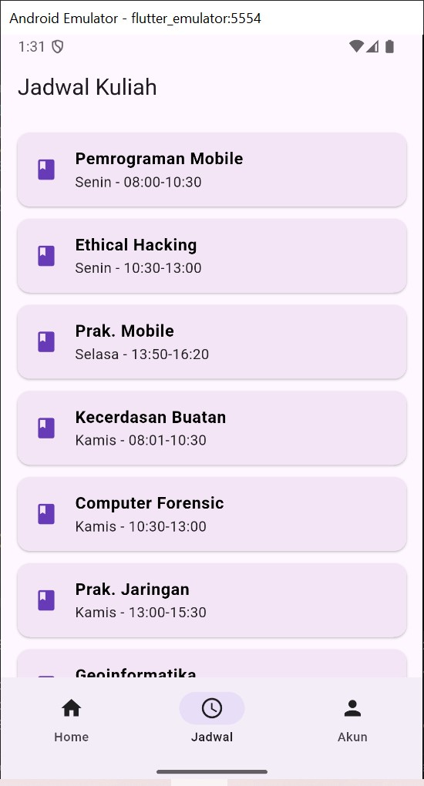
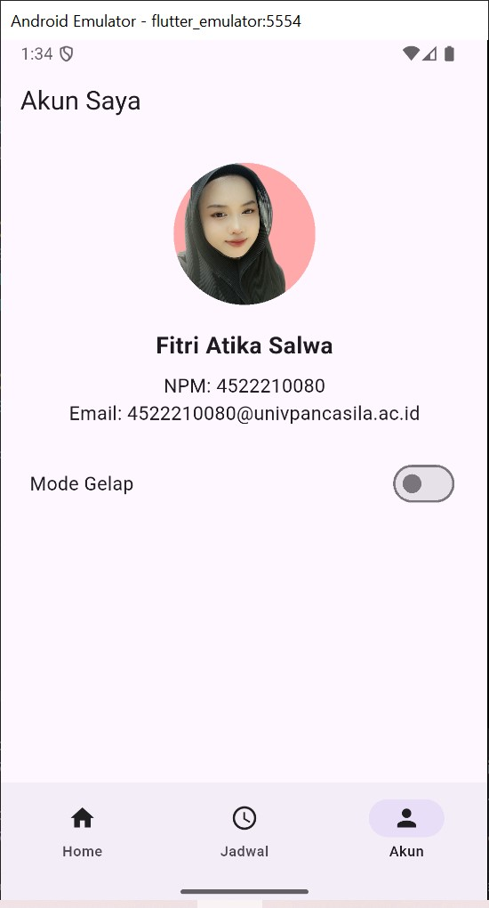
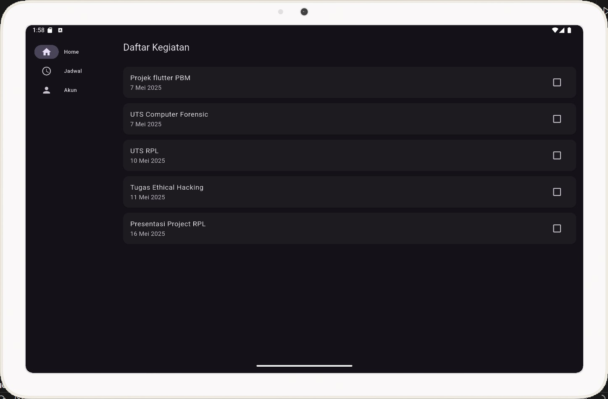
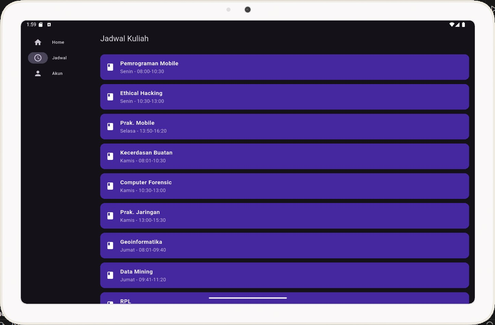
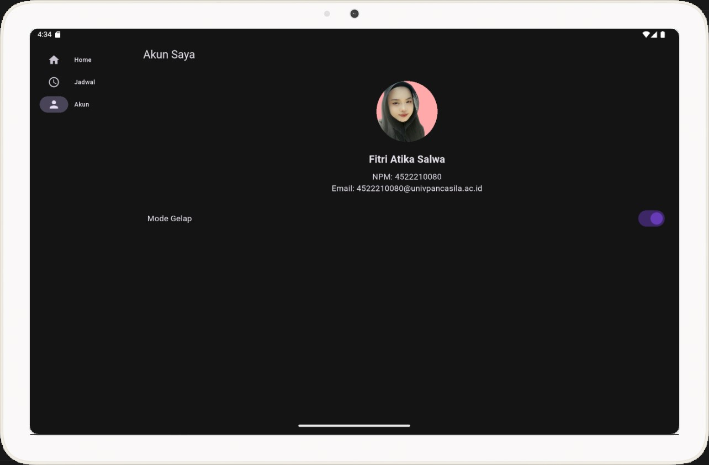

# 📱 Aplikasi Flutter 3 Halaman - Mahasiswa App

## 👩‍💻 Pengembang:

- **Nama:** Fitri Atika Salwa
- **NIM:** 4522210080
- **Email:** 4522210080@univpancasila.ac.id

---

## 📝 Deskripsi Aplikasi:

**Mahasiswa App** adalah aplikasi Flutter sederhana yang terdiri dari 3 halaman utama:

1. **Home** - Menampilkan daftar kegiatan mahasiswa.
2. **Jadwal** - Menampilkan jadwal kuliah mingguan.
3. **Profil** - Menampilkan informasi pengguna dan tombol untuk toggle Dark/Light Mode.

Aplikasi ini juga menggunakan `flutter_adaptive_scaffold` untuk memberikan tampilan yang responsif di berbagai ukuran layar (mobile dan tablet), serta mendukung Dark Mode.

---

## 🖼️ Screenshot Aplikasi:

### 📱 Tampilan Mobile

#### Halaman Home



#### Halaman Jadwal



#### Halaman Profil



---

### 💻 Tampilan Tablet

#### Halaman Home



#### Halaman Jadwal



#### Halaman Profil



## 📄 Penjelasan Tiap Halaman:

### 🏠 Halaman Home

Menampilkan daftar kegiatan mahasiswa berupa tugas dan jadwal penting. Setiap kegiatan memiliki checkbox untuk menandai apakah sudah selesai.

### 🗓️ Halaman Jadwal

Menampilkan list mata kuliah berdasarkan hari dan jam. Desain disesuaikan agar tetap nyaman dibaca dalam mode terang maupun gelap.

### 👤 Halaman Profil

Menampilkan data diri pengguna serta switch untuk mengaktifkan atau menonaktifkan Dark Mode. Gambar profil diambil dari local asset (`assets/images/anggota1.jpg`).

---

## ⚙️ Teknologi yang Digunakan:

- Flutter SDK 3.x
- `flutter_adaptive_scaffold`
- State Management: StatefulWidget
- Material Design
- Responsive Layout
- Dark Mode Toggle

---

## ▶️ Cara Menjalankan Aplikasi:

```bash
flutter pub get
flutter run
```
